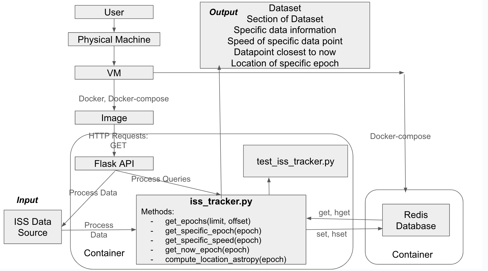

# ISS Data Analysis Project

## Overview

This project analyzes the positional and velocity data of the International Space Station (ISS) from an XML dataset. The tool provides functionalities to compute speed, determine the closest epoch to the current time, analyze the epoch range, and calculate the average speed of the ISS. The project is structured into two main Python scripts:

1. `iss_tracker.py` - Fetches and processes ISS state vector data, providing functions for analyzing position and velocity.

2. `test_iss_tracker.py` - Contains unit tests for the iss_tracker.py functions.

## Installation and Dependencies

This project utilized the following dependencies:

- Flask
- Redis
- Astropy
- Geopy


You can find the exact list of dependencies in the `requirements.txt` file.

## File Descriptions

File Descriptions

### 1. `iss_tracker.py`:
This script processes ISS state vector data from an online XML source and provides analysis functions.

### Functions:

**`speed(x_dot, y_dot, z_dot) -> float`** 

- Computes the speed of the ISS using its velocity components.

**`process_data(url)-> List[dict]`** 

- Fetches and parses XML data from the given URL, extracting epoch timestamps, positions, and velocities.
- 
**`get_iss_data() -> List[dict]`**
  
- Creates the dataset if not already initialized and returns the dataset to the user

**`closest_epoch(state_vectors, dateTime) -> dict`**

- Determines the state vector closest to dateTime.

**`epoch_range(state_vectors) -> (float, float, float)`**

- Computes the first and last epochs in the dataset and the difference between them.

**`avg_speed(state_vectors) -> float`**

- Computes the average speed of the ISS across all epochs.

**Flask Routes:**

- `/epochs`: Returns a portion of the dataset based on query parameters `limit` and `offset`.
- `/epochs/<epoch>`: Returns state vector data for a specific epoch.
- `/epochs/<epoch>/speed`: Returns the instantaneous speed for a specific epoch.
- `/now`: Returns the state vector closest to the current time along with its speed.
- `/epochs/<epoch>/location`: Computes the geolocation of the ISS in a given epoch.

### 2. `test_iss_tracker.py`

This script contains unit tests for `iss_tracker.py` using pytest.

Test Cases:

**`test_speed()`**

- Ensures speed function computes correct speeds based on given velocity components.

**`test_process_data()`**

- Validates the correctness of data extraction from the XML source.

**`test_closest_epoch()`**

- Ensures the function correctly identifies the closest state vector to the current time.

**`test_epoch_range()`**

- Verifies that the computed epoch range is correct.

**`test_avg_speed()`**

- Tests the average speed calculation with known values.

**`test_get_epochs()`**

 - This test ensures that the `/epochs` endpoint is working correctly.

**`test_get_specific_epoch()`**

 - This test validates the `/epochs/{epoch}` endpoint and handles date formatting.

**`test_get_specific_speed()`**

 - This test checks the `/epochs/{epoch}/speed` endpoint to ensure the speed data is correctly returned.

**`test_get_now_epoch()`**

- This test ensures that the `/now` endpoint returns the current epoch data correctly.

**`test_compute_location_astropy()`**

- Verifies the computation of the geolocation based on a specific epoch.

## Instructions
Follow these steps to set up and run the containerized tool:
### 1. Build and Run Docker Compose
To build and start the containerized environment, run the following command:
```bash
docker-compose up --build -d
```
### 2. Run Redis Connection
To interact with the Redis container:
```bash
docker exec -it <redis-container-id> redis-cli
```
### 3. Stop the Environment
To stop the running containers:
```bash
docker-compose down
```
### 4. Testing API Endpoints
Test retrieving all epochs:
```bash
curl http://127.0.0.1:5000/epochs
```
Test retrieving epochs with query parameters:
```bash
curl "localhost:5000/epochs?limit=2&offset=5"
```
Test retrieving specific epoch data:
```bash
curl "http://127.0.0.1:5000/epochs/2025-076T12:40:00.000000Z"
```
Test retrieving speed for a specific epoch:
```bash
curl "http://127.0.0.1:5000/epochs/2025-076T12:40:00.000000Z/speed"
```
Test retrieving the closest epoch:
```bash
curl http://127.0.0.1:5000/now
```
Test retrieving geolocation data for a specific epoch:
```bash
curl "http://127.0.0.1:5000/epochs/2025-076T12:40:00.000000Z/location"
```
### 5. Run Unit Tests
To run the unit tests, open the Docker container and run pytest:
```bash
docker exec -it <container-id> /bin/bash
pytest /code/test_iss_tracker.py
```

## Diagram


### Explanation of the Diagram

The user begins by interacting with a physical machine, which hosts a virtual machine. Inside this virtual machine, Docker is used to manage and run containerized images, providing an isolated environment for the application. Using Docker Compose, two containers are orchestrated: one for the Flask API, which processes incoming HTTP requests, and another for Redis, which is used to store and manage data generated by the `iss_tracker.py` file.

The Flask API container and the Redis container communicate through Redis, using `GET` and `SET` commands to retrieve and store data in real-time. When the Flask API receives a request, it interacts with the `iss_tracker.py` file within the same container, where relevant data is processed. Additionally, the container contains the `test_iss_tracker.py` file, which serves as the testing framework to verify the functionality of the methods within `iss_tracker.py`.

The `iss_tracker.py` file processes input data provided through a function designed for data processing, sourcing the ISS data, which is then passed to the necessary methods for calculation. The processed output, which are the results of the `iss_tracker.py` methods is then returned to the user. 


## AI and Resources

This README was generated with the assistance of AI (Chat-GPT) to streamline content formatting and improve clarity. The AI helped in structuring the document efficiently while ensuring that all critical details were covered. The code was almost entirely written by me. I was slightly confused on how to get information from redis in the specific format I required (converting a string to dict). GPT helped construct a solution for this seen in the line:
```return [{"epoch": epoch.split('.')[0], **eval(data)} for epoch, data in redis_client.hgetall("iss_data").items()]```

## References:
1. [ISS Trajectory Data](https://spotthestation.nasa.gov/trajectory_data.cfm)
   - Official NASA site for ISS trajectory data. This dataset provides the ISS state vectors, including epochs, positions, and velocities over a 15-day period.
2. [Python datetime Documentation](https://en.wikipedia.org/wiki/Great-circle_distance](https://docs.python.org/3/library/datetime.html )
   - Reference for Python's datetime module, useful for working with epoch timestamps.
4. [Datetime Formatting StackOverflow](https://salesforce.stackexchange.com/questions/58437/how-to-convert-string-into-datetime-format)
   - Reference for Python's datetime module, useful for working with epoch timestamps.
5. [Reading/Writing XML Files in Python](https://www.geeksforgeeks.org/reading-and-writing-xml-files-in-python/)
   - A useful guide on handling XML data in Python.
6. [Werkzeug Exceptions](https://www.geeksforgeeks.org/reading-and-writing-xml-files-in-python/](https://werkzeug.palletsprojects.com/en/stable/exceptions/)
   - Reference for handling exceptions in Flask using the Werkzeug library.
7. [GeoPy Resource](https://geopy.readthedocs.io/en/stable/#module-geopy.geocoders)
   - Reference for using GeoPy in order to get the location of our epoch. 
